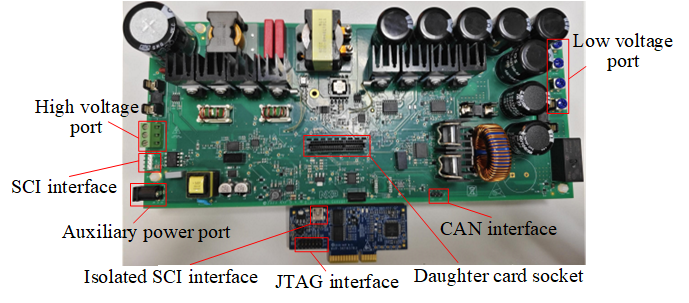

# NXP Application Code Hub

## AN14333: Bidirectional Resonant DC-DC Converter Design using MC56F83783

This is a Bidirectional Resonant DC-DC Converter Design using MC56F83783 DSC.

The MC56F83783 microcontroller is a member of the 32-bit 56800EX core-based Digital Signal Controllers (DSCs). Each device in the family combines the processing power of a 32-bit DSP and the functionality of a microcontroller with a flexible set of peripherals on a single chip. Due to its cost-effectiveness, configuration flexibility, and compact program code, 56F8xxxx is well-suited for many consumers and industrial applications.

Please refer to [AN14333](https://www.nxp.com/webapp/Download?colCode=AN14333&location=null&isHTMLorPDF=HTML) for complete instructions on how to use this software. 

#### Boards: Custom Board
#### Categories: Power Conversion
#### Peripherals: ADC, GPIO, PWM, TIMER
#### Toolchains: CodeWarrior

## Table of Contents
1. [Software](#step1)
2. [Hardware](#step2)
3. [Setup](#step3)
4. [Results](#step4)
5. [FAQs](#step5) 
6. [Support](#step6)
7. [Release Notes](#step7)

## 1. Software
- [SDK for MC56F83783: 2.13.1](https://mcuxpresso.nxp.com/en/builder?hw=MC56F83783&rel=677)
- [MCUXpresso Config Tools: v15](https://www.nxp.com/design/design-center/software/development-software/mcuxpresso-software-and-tools-/mcuxpresso-config-tools-pins-clocks-and-peripherals:MCUXpresso-Config-Tools)
- [CodeWarrior: v11.2](https://www.nxp.com/design/design-center/software/development-software/codewarrior-development-tools/downloads:CW_DOWNLOADS)
- [FreeMASTER: latest](https://www.nxp.com/design/design-center/software/development-software/freemaster-run-time-debugging-tool:FREEMASTER)

## 2. Hardware
- Power board: Bidirectional DCDC Converter Main Board Rev B 
- Control card: [HVP-56F83783](https://www.nxp.com/part/HVP-56F83783) Rev A or Rev A1
- Personal computer

## 3. Setup
1. Download the firmware to the control chip by connecting a debugger (P&E-Multilink) to SWD port of the control card using a 14-pin cable.
2. Plug in the control card, connect the DC source and load to setup the development enviroment, and using FreeMASTER by connecting the micro interface on the control card to the PC through a micro USB cable.
3. After DC source power on, select the desired working mode and run the converter in FreeMASTER, then the system starts working.

Please refer to [AN14333](https://www.nxp.com/webapp/Download?colCode=AN14333&location=null&isHTMLorPDF=HTML) chapter 5 for complete instructions on how to setup in different working modes.

## 4. Results
Please refer to [AN14333](https://www.nxp.com/webapp/Download?colCode=AN14333&location=null&isHTMLorPDF=HTML) chapter 5 for test results of this design.

## 5. FAQs
**5.1 Which operating modes does this design implement ?**

- BCM: Battery Charge Mode
- BDM: Battery Discharge Mode
- Working mode transition between BCM and BDM controlled by the FreeMASTER

**5.2 How does the DC-DC converter connect to the front-end AC-DC to work?**

- Connect the high voltage port to the DC bus port of the AC-DC.
- Connect the communication port. J6 on the DC-DC board is a reserved UART communication port for communication with the AC-DC.

**5.3 How to use FreeMASTER to control the system?**

Get a basic idea of FreeMASTER with [FreeMASTER User Guide](https://www.nxp.com/docs/en/user-guide/FMSTERUG.pdf). Go to [NXP community FreeMASTER Support Portal](https://community.nxp.com/t5/FreeMASTER/bd-p/freemaster) or [FreeMASTER landing page](https://www.nxp.com/freemaster) for more information if desired.

## 6. Support

#### Project Metadata
<!----- Boards ----->

<!----- Categories ----->

<!----- Peripherals ----->
   

<!----- Toolchains ----->

Questions regarding the content/correctness of this example can be entered as Issues within this GitHub repository.

>**Warning**: For more general technical questions regarding NXP Microcontrollers and the difference in expected funcionality, enter your questions on the [NXP Community Forum](https://community.nxp.com/)

## 7. Release Notes
| Version | Description / Update                           | Date                        |
|:-------:|------------------------------------------------|----------------------------:|
| 1.0     | Initial release on Application Code Hub        | June 25th 2024 |

